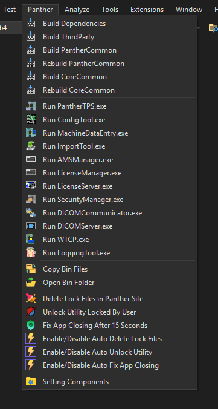
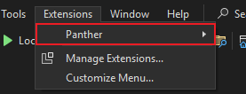
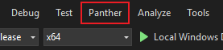
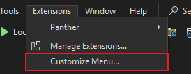
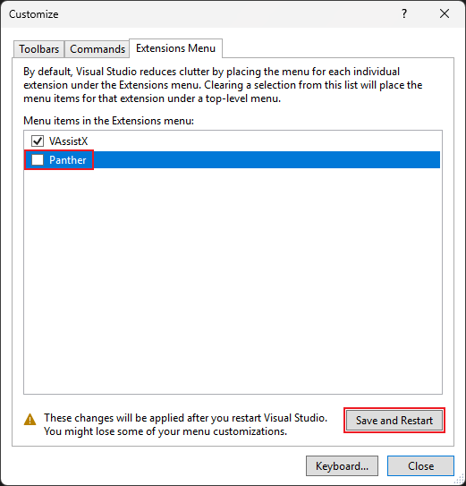
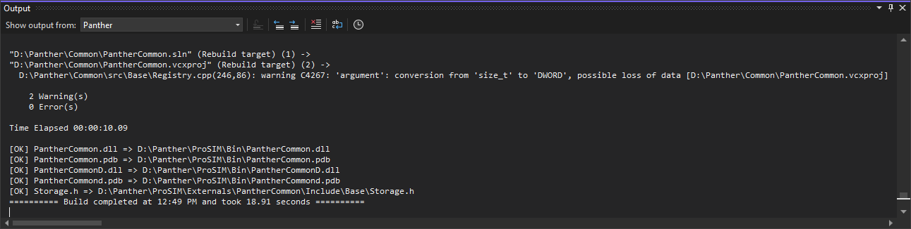
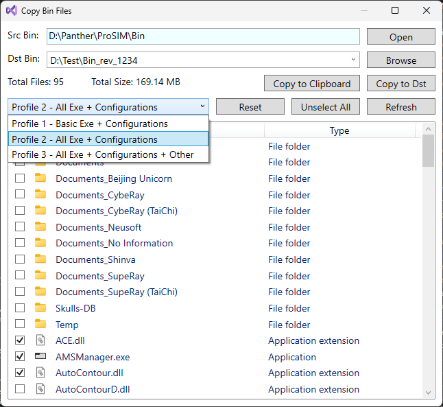
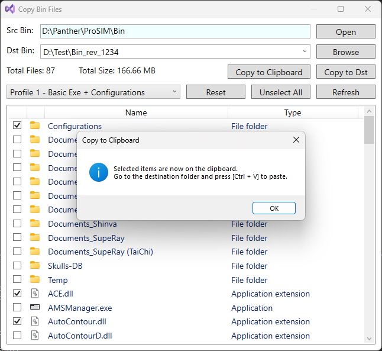
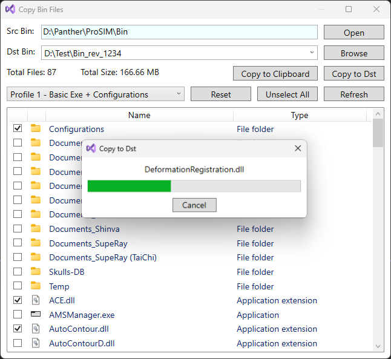
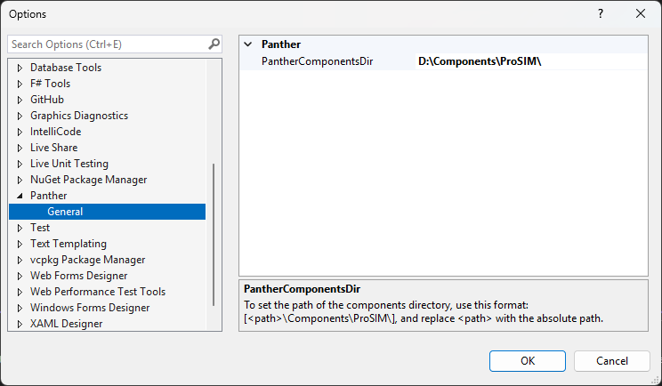

# Panther.vsix
Visual Studio Extension for Panther Project

|   #   | Version            | Support |
| :---: | :----------------- | :-----: |
|   1   | Visual Studio 2019 |   Yes   |
|   2   | Visual Studio 2022 |   Yes   |

### Bring Panther menu to main menu
- By default, Panther menu will be placed inside the Extensions menu

  
- Panther menu can be displayed in main menu

  
- Steps to bring Panther menu to main menu
  1. Go to `[Extensions -> Customize Menu...]`

     
  3. Uncheck `Panther` and save the setting

     

### Panther extension features
|   #   | Command                               | Output Pane | Description                                                                                                                                                                                     |
| :---: | :------------------------------------ | :---------: | :---------------------------------------------------------------------------------------------------------------------------------------------------------------------------------------------- |
|   1   | Build Dependencies                    |      x      | Build dependencies without using the command line                                                                                                                                               |
|   2   | Build ThirdParty                      |      x      | Build thirdparty without using the command line                                                                                                                                                 |
|   3   | Build PantherCommon                   |      x      | Build PantherCommon solution and copy the output files to the destination folder if there are differences                                                                                       |
|   4   | Rebuild PantherCommon                 |      x      | Rebuild PantherCommon solution and copy the output files to the destination folder if there are differences                                                                                     |
|   5   | Build CoreCommon                      |      x      | Build CoreCommon solution and copy the output files to the destination folder if there are differences                                                                                          |
|   6   | Rebuild CoreCommon                    |      x      | Rebuild CoreCommon solution and copy the output files to the destination folder if there are differences                                                                                        |
|   7   | Run PantherTPS.exe                    |             | Run PantherTPS.exe if it exists in the Bin folder                                                                                                                                               |
|   8   | Run ConfigTool.exe                    |             | Run ConfigTool.exe if it exists in the Bin folder                                                                                                                                               |
|   9   | Run MachineDataEntry.exe              |             | Run MachineDataEntry.exe if it exists in the Bin folder                                                                                                                                         |
|  10   | Run ImportTool.exe                    |             | Run ImportTool.exe if it exists in the Bin folder                                                                                                                                               |
|  11   | Run AMSManager.exe                    |             | Run AMSManager.exe if it exists in the Bin folder                                                                                                                                               |
|  12   | Run LicenseManager.exe                |             | Run LicenseManager.exe if it exists in the Bin folder                                                                                                                                           |
|  13   | Run LicenseServer.exe                 |             | Run LicenseServer.exe if it exists in the Bin folder                                                                                                                                            |
|  14   | Run SecurityManager.exe               |             | Run SecurityManager.exe if it exists in the Bin folder                                                                                                                                          |
|  15   | Run DICOMCommunicator.exe             |             | Run DICOMCommunicator.exe if it exists in the Bin folder                                                                                                                                        |
|  16   | Run DICOMServer.exe                   |             | Run DICOMServer.exe if it exists in the Bin folder                                                                                                                                              |
|  17   | Run WTCP.exe                          |             | Run WTCP.exe if it exists in the Bin folder                                                                                                                                                     |
|  18   | Run LoggingTool.exe                   |             | Run LoggingTool.exe if it exists in the Bin folder                                                                                                                                              |
|  19   | Copy Bin Files                        |      x      | Open the `Copy Bin Files` dialog so the user can select items in the Bin folder to copy. By default, items are auto-selected depending on the selected profile                                  |
|  20   | Open Bin Folder                       |             | Open the Bin folder in Explorer                                                                                                                                                                 |
|  21   | Delete Lock Files in Panther Site     |      x      | Scan and delete all locked files that exist in Panther Site                                                                                                                                     |
|  22   | Unlock Utility Locked By User         |             | Unlock to run utilities at the same time                                                                                                                                                        |
|  23   | Fix App Closing After 15 Seconds      |             | Fix the application automatically closes after 15 seconds                                                                                                                                       |
|  24   | Enable/Disable Auto Delete Lock Files |             | Automatically delete lock files when Panther build is complete or run any application from Panther menu. The default is `Enable`                                                                |
|  25   | Enable/Disable Auto Unlock Utility    |             | Automatically unlock the utility when Panther build is complete or run any application from the Panther menu. This is also triggered when performing `Copy Bin Files`. The default is `Enable`  |
|  26   | Enable/Disable Auto Fix App Closing   |             | Automatically fix application closing when Panther build is complete or run any application from Panther menu. This is also triggered when performing `Copy Bin Files`. The default is `Enable` |
|  27   | Setting Components                    |             | Open the `Options -> Panther` page to set the `PantherComponentsDir` macro                                                                                                                      |

### Some commands will display results to Output Pane

### `Copy Bin Files` dialog

### Settting `PantherComponentsDir`
